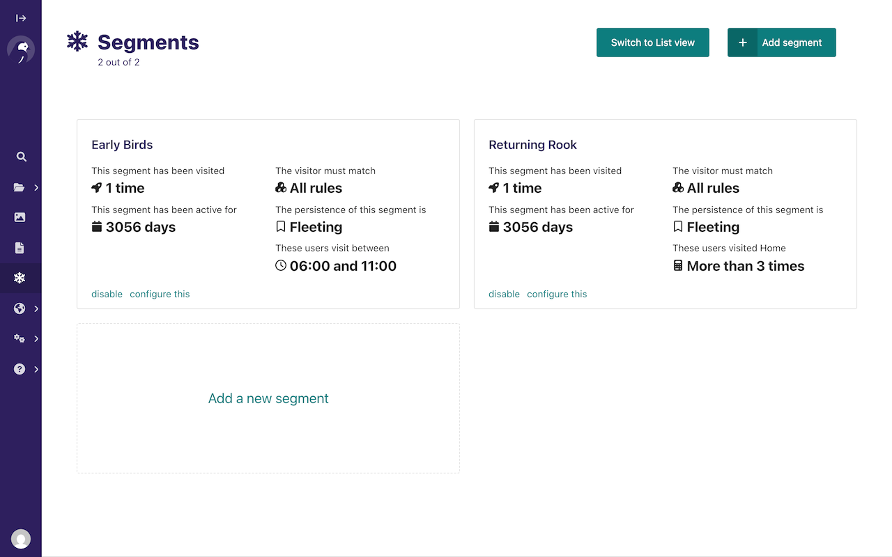

# [Wagtail Personalisation](https://wagtail-nest.github.io/wagtail-personalisation/)

> A Wagtail add-on for showing personalized content.

Wagtail Personalisation is a fully-featured personalisation module for [Wagtail CMS](https://wagtail.org/). It enables editors to create customised pages - or parts of pages - based on segments whose rules are configured directly in the admin interface.



## Instructions

Wagtail Personalisation requires Wagtail 7.0+ and Django 5.2+

To install the package with pip:

```console
pip install wagtail-personalisation
```

Next, include the `wagtail_personalisation`, `wagtail_modeladmin` and `wagtailfontawesomesvg` apps in your project's `INSTALLED_APPS`:

```python
INSTALLED_APPS = [
    # ...
    'wagtail.contrib.modeladmin',  # Don't repeat if it's there already
    'wagtail_personalisation',
    'wagtailfontawesomesvg',
    # ...
]
```

Make sure that `django.contrib.sessions.middleware.SessionMiddleware` has been added in first, this is a prerequisite for this project.

```python
MIDDLEWARE = [
    'django.contrib.sessions.middleware.SessionMiddleware',
    # ...
]
```

## Documentation

The full documentation is available at [wagtail-nest.github.io/wagtail-personalisation](https://wagtail-nest.github.io/wagtail-personalisation/). For LLM-assisted tooling, there is also a concise [`llms.txt`](https://wagtail-nest.github.io/wagtail-personalisation/llms.txt) and a complete [`llms-full.txt`](https://wagtail-nest.github.io/wagtail-personalisation/llms-full.txt).

## Sandbox

To experiment with the package you can use the sandbox provided in this repository. To install this you will need to create and activate a virtualenv and then run `make sandbox`. This will start a fresh Wagtail install, with the personalisation module enabled, on http://localhost:8000 and http://localhost:8000/cms/. The superuser credentials are `superuser@example.com` with the password `testing`.

## Contributing

See anything you like in here? Anything missing? We welcome all support, whether on bug reports, feature requests, code, design, reviews, tests, documentation, and more. Please have a look at our [contribution guidelines](docs/CONTRIBUTING.md).

## Acknowledgements

This project is currently maintained by the Wagtail Nest team.

It was originally developed by Boris Besemer (@blurrah) and Jasper Berghoef (@jberghoef) for Lab Digital (https://labdigital.nl).
