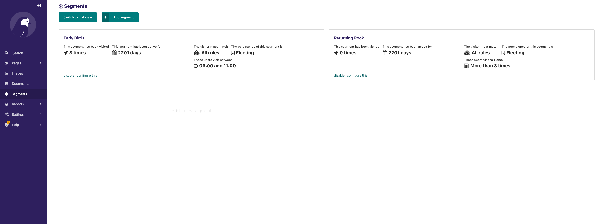

.. start-no-pypi

.. image:: https://readthedocs.org/projects/wagtail-personalisation/badge/?version=latest
     :target: http://wagtail-personalisation.readthedocs.io/en/latest/?badge=latest

.. image:: https://travis-ci.org/wagtail/wagtail-personalisation.svg?branch=master
    :target: https://travis-ci.org/wagtail/wagtail-personalisation

.. image:: http://codecov.io/github/wagtail/wagtail-personalisation/coverage.svg?branch=master
    :target: http://codecov.io/github/wagtail/wagtail-personalisation?branch=master

.. image:: https://img.shields.io/pypi/v/wagtail-personalisation.svg
    :target: https://pypi.python.org/pypi/wagtail-personalisation/

.. end-no-pypi

.. image:: logo.png
   :height: 261
   :width: 300
   :scale: 50
   :alt: Wagxperience
   :align: center

Wagtail Personalisation
=======================

Wagtail Personalisation is a fully-featured personalisation module for
`Wagtail CMS`_. It enables editors to create customised pages
- or parts of pages - based on segments whose rules are configured directly
in the admin interface.

.. _Wagtail CMS: http://wagtail.io/

Instructions
------------
Wagtail Personalisation requires Wagtail 2.0 or 2.1 and Django 1.11 or 2.0.

To install the package with pip:

.. code-block:: console

    pip install wagtail-personalisation

Next, include the ``wagtail_personalisation``, ``wagtail.contrib.modeladmin``
and ``wagtailfontawesome`` apps in your project's ``INSTALLED_APPS``:

.. code-block:: python

    INSTALLED_APPS = [
        # ...
        'wagtail.contrib.modeladmin',
        'wagtail_personalisation',
        'wagtailfontawesome',
        # ...
    ]

Make sure that ``django.contrib.sessions.middleware.SessionMiddleware`` has
been added in first, this is a prerequisite for this project.

.. code-block:: python

    MIDDLEWARE = [
        'django.contrib.sessions.middleware.SessionMiddleware',
        # ...
    ]

Documentation
-------------

You can find more information about installing, extending and using this module
on `Read the Docs`_.

.. _Read the Docs: http://wagtail-personalisation.readthedocs.io

Sandbox
-------

To experiment with the package you can use the sandbox provided in
this repository. To install this you will need to create and activate a
virtualenv and then run ``make sandbox``. This will start a fresh Wagtail
install, with the personalisation module enabled, on http://localhost:8000
and http://localhost:8000/cms/. The superuser credentials are
``superuser@example.com`` with the password ``testing``.
