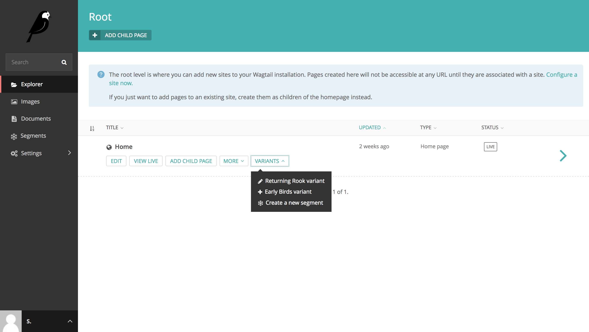
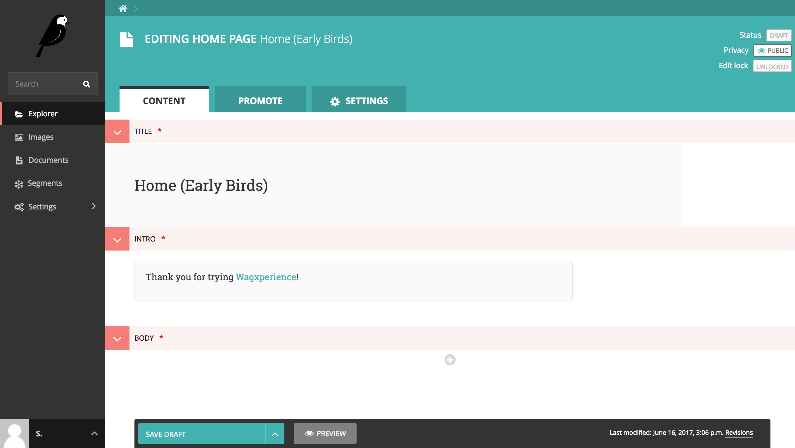
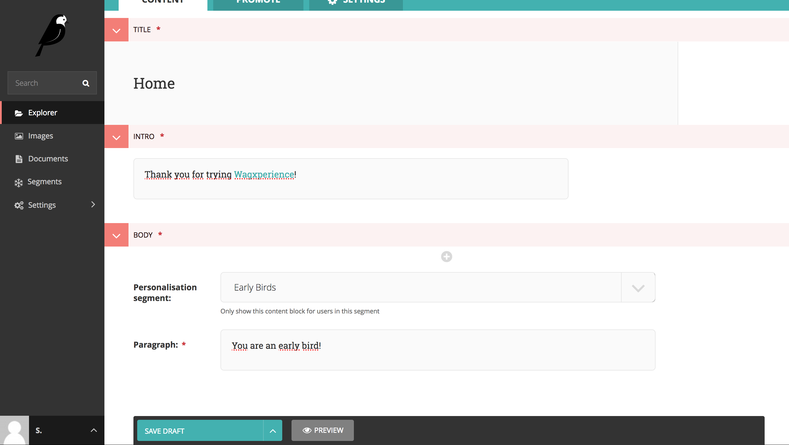
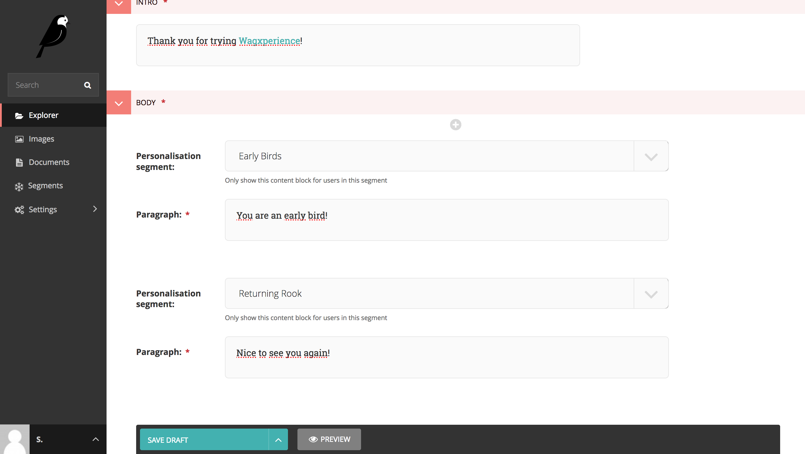

Creating personalised content
=============================

Once you've created a segment you can start serving personalised content to your
visitors. To do this, you can choose one of three methods.

1. Create a page variant for a segment.
2. Use StreamField blocks visible for a segment only.
3. Use a template block visible for a segment only.

Method 1: Create a page variant
-------------------------------

**Why you would want to use this method**

* It has absolutely no restrictions, you can change anything you want.
* That's pretty much it.

**Why you would want to use a different method**

* You are editing a page that changes often. You would probably rather not
  change the variation(s) every time the original page changes.

To create a variant of a page for a specific Segment (which you can change to
your liking after creating it), simply go to the Explorer section and find the
page you would like to personalize.

When you hover over a page, you'll notice a "Variants" dropdown button appears.
Click the button and select the segment you would like to create personalised
content for.

Once you've selected the segment, a copy of the original page will be created
with a title that includes the segment. Don't worry, your visitors won't be able
to see this title. It's only there for your reference.

You can change everything on this page you would like. Visitors that are appointed
to your segment will automatically see the new variant you've created for them
when attempting to visit the original page.

Method 2: Use a StreamField block
---------------------------------

Preparing a page and it's StreamField blocks for this method is described in the
Usage guide for developers. Please refer to
:ref:`implementing_streamfield_blocks` for more information.

**Why you would want to use this method**

* Allows you to create personalised content in the original page (without
  creating a variant).
* Create multiple StreamField blocks for different segments inline.

**Why you would want to use a different method**

* You need someone tech savvy to change the back-end implementation.

To create personalised StreamField blocks, first select the page you wan't to
create the content for. Note that the personalisable StreamField blocks must be
activated on the page by your developer.

Scroll down to the block containing the StreamField and add a personalisable
block. The first input field in the block is a dropdown allowing you to select
the segment this StreamField block is ment for.

If you want, you can even add multiple blocks and change the segment to show
different content between segments!

Once saved, the page will selectively show StreamField blocks based on the
visitor's segment.

Method 3: Use a template block
------------------------------

Setting up content in this manner is described in the Usage guide for
developers. Please refer to :ref:`implementing_template_blocks` for more
information.
