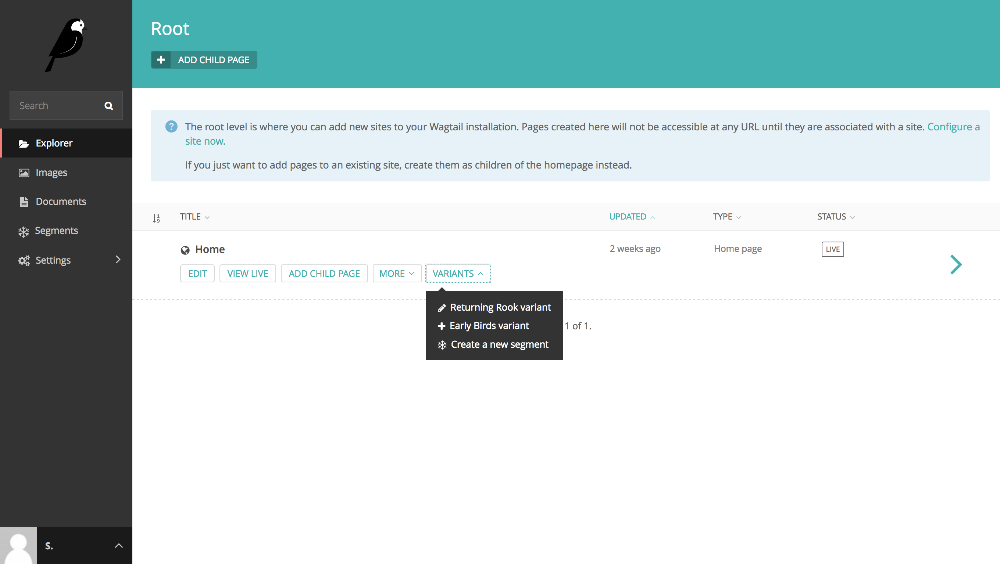
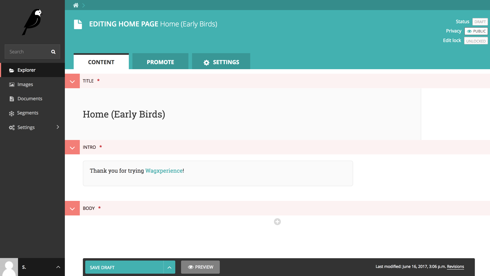

Creating personalized content
=============================

Once you've created a segment you can start serving personalised content to your
visitors. To do this, you can go one of three directions.

1. Create a variant of a page for your segment.
2. Use StreamField blocks only visible to your segment.
3. Use a template block only visible to your segment.

Method 1: Create a variant
--------------------------

*Why you'd want to use this method*

* It has absolutely no restrictions, change anything you want.
* That's pretty much it.

*Why you'd want to use a different method*

* You are editing a page that changes often. You'd probably rather not change
  variant every time the original page changes.

To create a variant from a page for a specific Segment (which you can change to
your liking after creating it), simply go to the Explorer section and find the
page you'd like to personalize.

When you hover over a page, you'll notice a "Variants" dropdown button appears.
Click the button and select the segment you'd like to create personalized
content for.

Once you've selected the segment, a copy of the original page will be created
with a title that includes the segment. Don't worry, your visitors won't be able
to see this title. It's only there for your reference.

You can change everything on this page you'd like. Visitors that are appointed
to your segment will automatically see the new variant you've created for them
when attempting to visit the original page.

Method 2: Use a StreamField block
---------------------------------

This method requires changes to the back-end of your website. Take a look at
:doc:`../usage_guide/implementation` for more information.

Method 3: Use a template block
------------------------------

This method requires changes to the back-end of your website. Take a look at
:doc:`../usage_guide/implementation` for more information.
