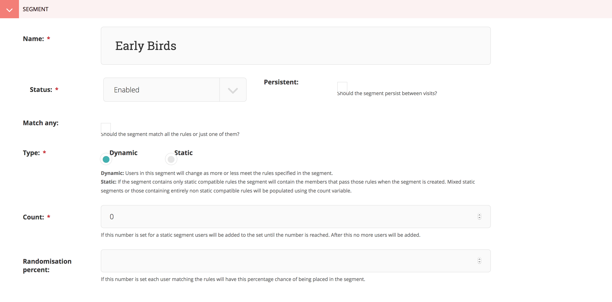
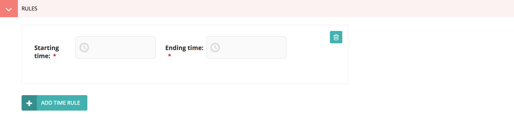

Creating a segment
==================

To create a segment, go to the "Segments dashboard" and click "Add segment".
You can find the segments dashboard in the administration menu on the left of
the page.

On this page you will be presented with two forms. One with specific information
about your segment, the other allowing you to choose and configure your
rules.

Set segment specific options
^^^^^^^^^^^^^^^^^^^^^^^^^^^^

1. Enter a name for your segment.

    Choose something meaningful like "Newsletter campaign visitors". This will
    ensure you'll have a general idea which visitors are in this segment in
    other parts of the administration interface.

2. Select the status of the segment *Optional*

    You will generally keep this one **enabled**. If for some reason you want
    to disable the segment, you can change this to **disabled**.

3. Set the segment persistence. *Optional*

    When persistence is **enabled**, your segment will stick to the visitor once
    applied, even if the rules no longer match the next visit.

4. Select whether to match any or all defined rules. *Optional*

    **Match any** will result in a segment that is applied as soon as one of
    your rules matches the visitor. When **match all** is selected, all rules
    must match before the segment is applied.

Defining rules
^^^^^^^^^^^^^^

5. Choose the rules you want to use.

    Wagxperience comes with a basic set of :doc:`../default_rules` that allow
    you to get started quickly. The rules you define will be evaluated once a
    visitor makes a request to your application.

    The rules that come with Wagxperience are as follows:

    .. toctree::
       :maxdepth: 2

       ../default_rules

Click "save" to store your segment. It will be enabled by default, unless
otherwise defined.
