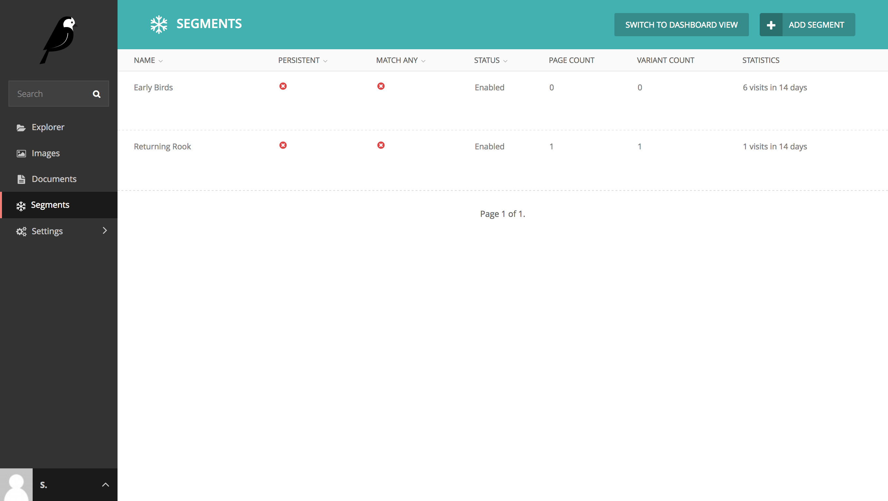
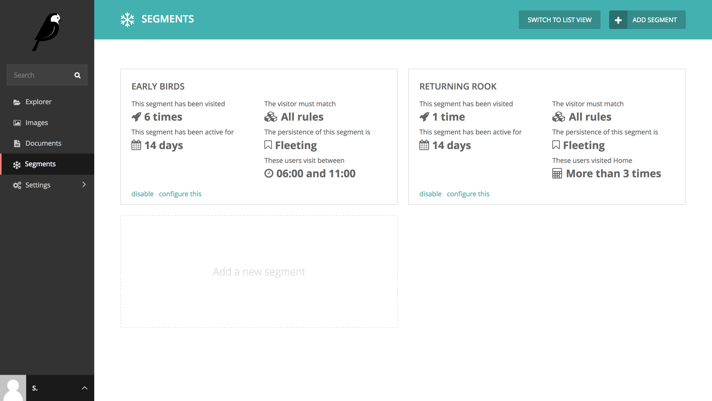

The segments dashboard
======================

Wagxperience comes with two different views for it's segment dashboard. A "list
view" and a "dashboard view". Where the dashboard view attempts to show all
relevant information and statistics in a visually pleasing manner, the list view
is more fitted for sites using large amounts of segments, as it may be
considered more clear in these cases.

Switching between views
-----------------------

By default, Wagxperience's "dashboard view" is active on the segment dashboard.
If you'd like to switch between the dashboard view and list view, open the
segment dashboard and click the "Switch view" button in the green header at the
top of the page.

.. figure:: ../_static/images/segment_dashboard_header.png
   :alt: The header containing the "Switch view" button.

Using the list view
-------------------

The advantages of using the list view:

* Uses the familiar table view that is used on many other parts of the Wagtail
  administration interface.
* Offers a better overview for large amounts of segments.
* Allows for reordering based on fields, such as name or status.

Definitions
^^^^^^^^^^^

Name
    The name of your segment.

Persistent
    If this is disabled (default), whenever a visitor requests a page, the rules
    of this segment are reevaluated. This means that when the rules no longer
    match, the visitor is no longer a part of this segment. However, if
    persistence is enabled, this segment will "stick" with the visitor, even when
    the rules no longer apply.

Match any
    If this is disabled (default) all rules of this segment must match a visitor
    before the visitor is appointed to this segment. If this is enabled, only 1
    rule has to match before the visitor is appointed.

Status
    Indicates whether this segment is active (default) or inactive. If it has
    been set to 'inactive', visitors will not be appointed to this segment and no
    personalized content for this segment will be shown to visitors.

Page count
    The amount of pages that have variants using this segment.

Variant count
    The total amount of variants for this segment. Does not yet apply, as this
    will always match the amount of pages in the "Page count".

Statistics
    Shows the amount of visits the this segment and the days it has been
    enabled. If the segment is disabled and then re-enabled, these statistics
    will reset.

Using the dashboard view
------------------------

The advantages of using the dashboard view:

* Offers a more pleasing visual representation of segments.
* Focused on giving insights about your segments at a glance.
* Shows the actual rules of a segment.
* Gives more wordy explanation about the information shown.

